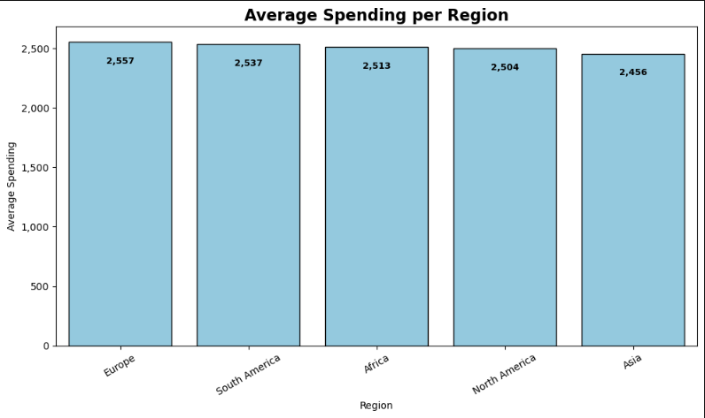
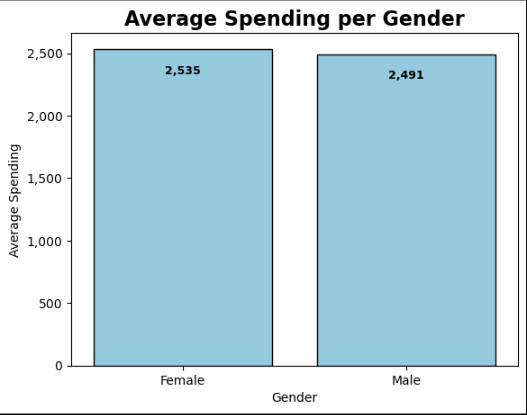
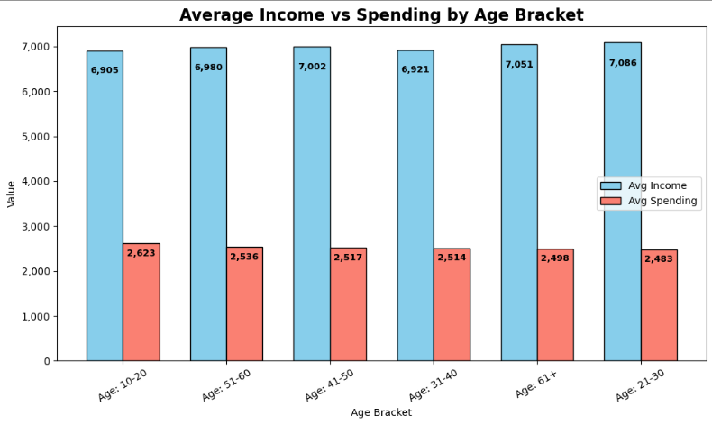
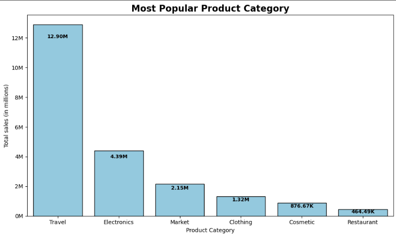
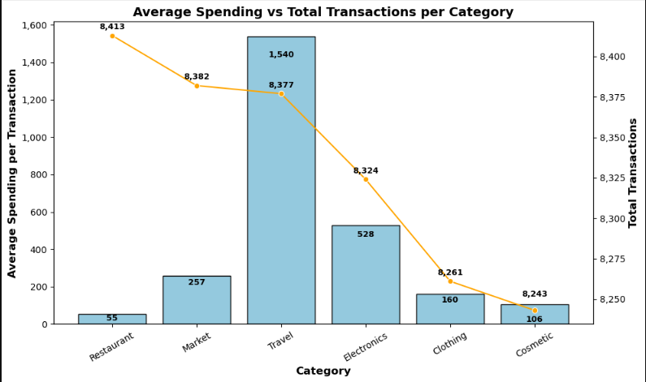
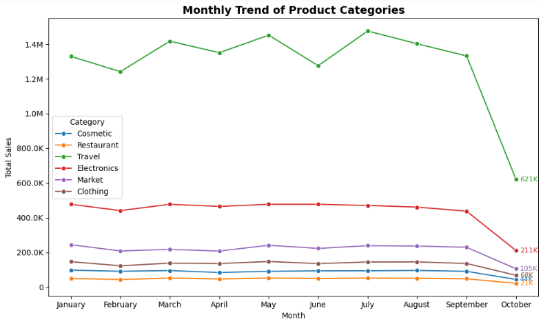
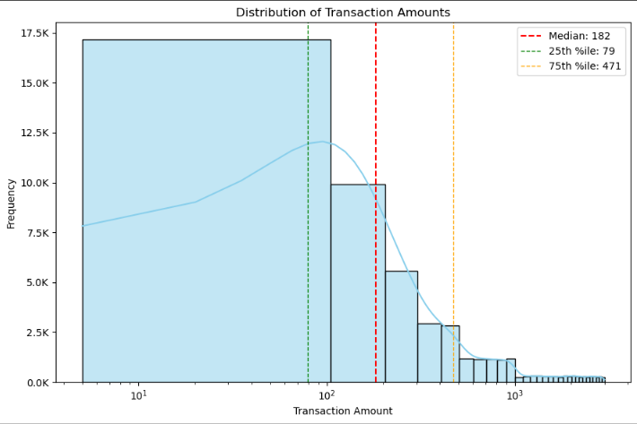

# Customer Spending and Transaction Analysis

**Executive Summary:**  
This project analyzes customer demographics and transaction data using **SQL + Python** to uncover spending behaviors, popular product categories, and seasonal trends. The results highlight which groups drive the most revenue, when spending peaks, and how businesses can optimize marketing and product strategies.  

Datasets were obtained through Kaggle.

- [Customer Demographics and Spending dataset](https://www.kaggle.com/datasets/simranjitkhehra/customer-demographics-and-spending)
- [Customer Transactions dataset](https://www.kaggle.com/datasets/bkcoban/customer-transactions)

Missing values were cleaned (~5k rows excluded for null Gender/Income/Spending).

---

## Project Overview

This project focuses on analyzing customer spending transaction data to uncover purchasing behaviors and spending patterns. The dataset contains records of customer transactions across various categories. 

Using Python and data analytics libraries, the analysis includes data cleaning, exploratory analysis, and visualization of spending trends.

### Key Questions

#### Demographic Analysis

1. What is the average spending by region and gender?
2. Trend of income vs spending habits by age and product category?

#### Transaction Analysis

1. Which is the most popular product category?
2. What's the average spending per transaction by product category?
3. What's the monthly trend in transactions?
4. Are the most purchases cheap?

---

## Tools and Libraries

- **Python (pandas, matplotlib, seaborn, numpy)** - used for data wrangling and EDA
- **SQL Server - sqlachemy** - used to query in Python
- **Jupyter Notebook**

---

## Results

### Demographic Analysis  

**1. Average Spending by Region**  
- Europe shows the highest spending, followed by Asia and North America.  
- Suggests stronger purchasing power or higher demand in these markets.  

  

---

**2. Average Spending by Gender**  
- Females spend slightly more than males on average (~44 units difference).  
- Indicates potential for gender-targeted marketing campaigns.  

  

---

**3. Income & Spending by Age Brackets**  
- Spending peaks in the **21–40 age groups**, aligning with prime working years.  
- Higher income does not always equal higher spending, especially in older brackets.  

  

---

### Transaction Analysis  

**4. Popular Product Categories**  
- A few categories dominate transaction volume, making them critical for revenue.  
- Smaller categories may represent opportunities for growth or diversification.  

  

---

**5. Average Transactions per Category**  
  - Categories differ in transaction frequency:  
  - Some drive frequent low-value purchases (e.g., groceries).  
  - Others drive fewer but high-value transactions (e.g., electronics).  

  

---

**6. Monthly Trend of Spending by Category**  
- Seasonal spikes suggest holidays, promotions, or demand cycles.  
- Consistent categories show stable baseline demand.  

  

---

**7. Distribution of Transaction Amounts**  
- Most purchases are **low to mid-range**.  
- A long-tail distribution exists with fewer **high-value transactions**, typical of retail data.  

 

---

### Others

[Check the Notebook here!](customer_spending_transaction_analysis.ipynb)

